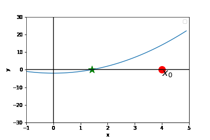
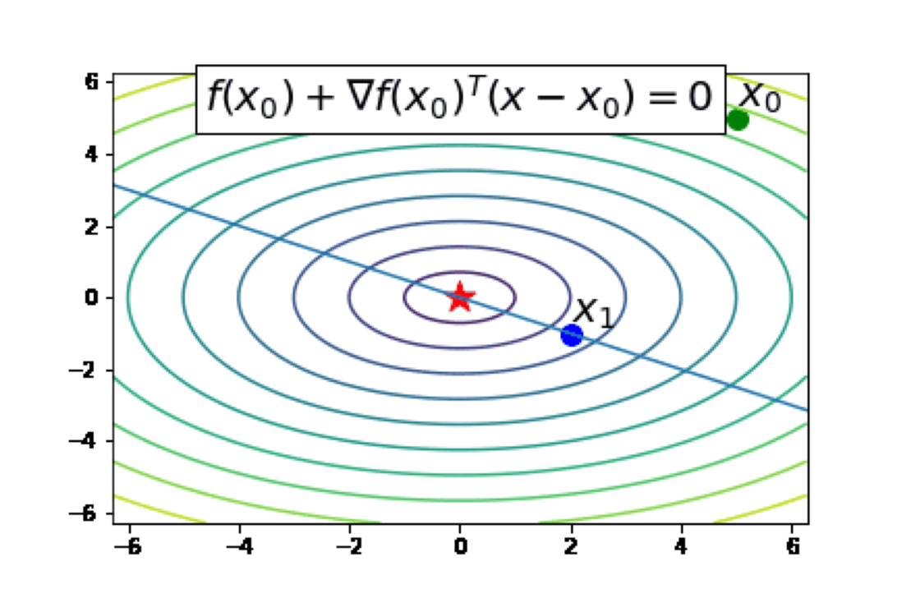
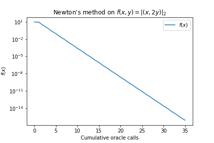
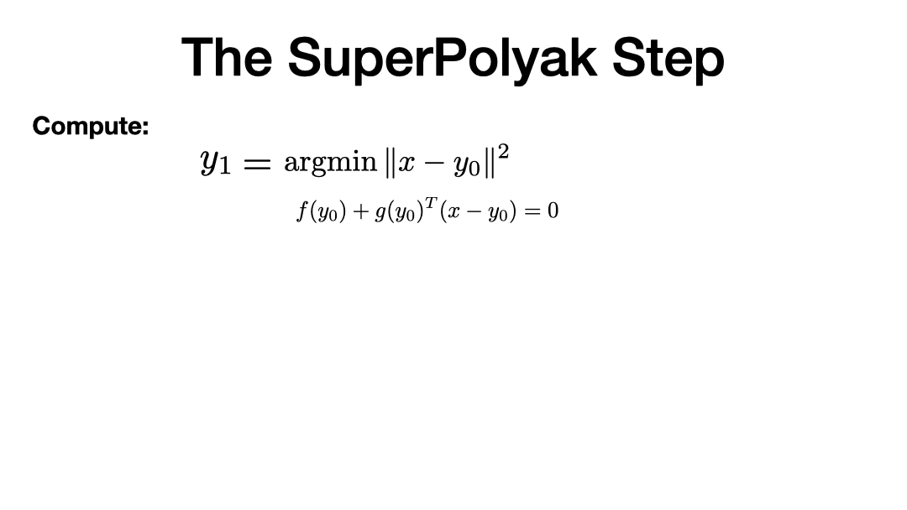
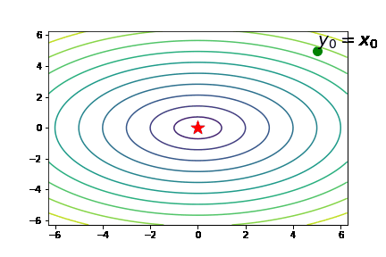
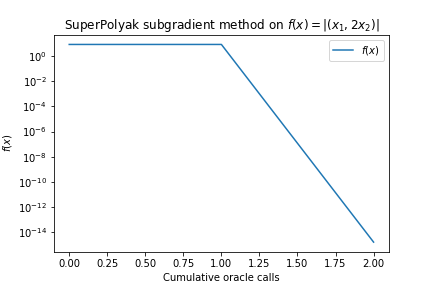

# Superpolyak.py

A pytorch implementation of the SuperPolyak subgradient method [[1]](#1).

**Quick demo:** [SuperPolyakDemo.ipynb](SuperPolyakDemo.ipynb).

Outline
- [What is SuperPolyak?](#what-is-superpolyak)
  - [Problem formulation](#problem-formulation)
    - [Example 1: Fitting a 1-hidden layer neural network with max-pooling](#example-1-fitting-a-1-hidden-layer-neural-network-with-max-pooling)
    - [Example 2: Solving a smooth and strongly convex optimization problem](#example-2-solving-a-smooth-and-strongly-convex-optimization-problem)
- [What is SuperPolyak doing?](#what-is-superpolyak-doing)
  - [Newton's method](#newtons-method)
  - [Slow-down of Newton's method in higher dimensions](#slow-down-of-newtons-method-in-higher-dimensions)
  - [The SuperPolyak step: a method for repairing Newton's method in higher dimensions](#the-superpolyak-step-a-method-for-repairing-newtons-method-in-higher-dimensions)
  - [Practical improvements: early termination of the SuperPolyak step](#practical-improvements-early-termination-of-the-superpolyak-step)
  - [When does SuperPolyak work?](#when-does-superpolyak-work)
  - [Comparison to semismooth Newton](#comparison-to-semismooth-newton)
    - [Potential benefits of SuperPolyak over semismooth Newton](#potential-benefits-of-superpolyak-over-semismooth-newton)
- [How to use](#how-to-use)
  - [Standalone optimizer class](#standalone-optimizer-class)
  - [Coupling with a fallback algorithm (e.g. SGD)](#coupling-with-a-fallback-algorithm-eg-sgd)
- [References](#references)

# What is SuperPolyak?

## Problem formulation
SuperPolyak is a **first-order** method for solving (possibly) nonsmooth equations/optimization problems of the form:

$$
f(\bar x) = 0 \qquad \iff \qquad  \min f(x)
$$

where $f \colon \mathbb{R}^d \rightarrow \mathbb{R_{\geq 0}}$ is a _nonnegative function_ with minimal value $0$. When certain **minimal assumptions** are met, SuperPolyak locally converges **superlinearly** (i.e., "double exponentially").


### Example 1: Fitting a 1-hidden layer neural network with max-pooling


Let's try to fit a simple neural network with max-pooling to data

$$
(a_1, y_1), \ldots, (a_m, y_m)
$$

The network has $d$ parameters, $r$ hidden units, and $m$ data samples. Concretely, we want to solve the $m$ equations for weights $\beta_j$:

$$
\max_{j \in [r]} \langle a_i, \beta_j\rangle = y_i \qquad i \in [m]
$$

We reformulate this as a root finding problem:

$$
\text{Find a root of } f(\beta_1, \ldots, \beta_r) = \frac{1}{m} \sum_{i=1}^m |y_i - \max_{j \in [r]} \langle a_i, \beta_j\rangle|.
$$

Now let's do a quick experiment:
- **Setup:**
  - We use Gaussian data.
  - We set $d = 500$, vary $r$, and set $m = 3dr$.
  - We run SuperPolyak and a standard first-order method (Polyak).
- **Conclusion:**
  - Superpolyak outperforms Polyak both in terms of time and oracle calls (evals of $f$ and its gradient).


### Example 2: Solving a smooth and strongly convex optimization problem

Let's try to solve the following optimization problem:

$$
\min l(x)
$$

where $l$ is a smooth and strongly convex function. If $l$ is nonnegative, we can apply SuperPolyak to $l$. Otherwise, we reformulate it via first-order optimality conditions (due to convexity):

$$
\text{Find a root of } \nabla l(x).
$$

The gradient $\nabla l$ is a mapping, not a function. No problem, just reformulate via the norm:

$$
\text{Find a root of } f(x) = \|\nabla l(x)\|.
$$

**TODO:** Vas please make a pretty plot like the above for logistic regression.

**TODO** Need newton's method

- **Setup:**
  - We fit a logistic regression model with l2 regularization to Gaussian data.
  - We vary the dimension $d$ and the number of parameters $m$.
  - We run SuperPolyak, gradient descent, and Newton's method.
- **Conclusion:**
  - Superpolyak outperforms both methods both in terms of time and oracle calls (evals of $f$ and its gradient)?


# What is SuperPolyak doing?

SuperPolyak is inspired by _Newton's method_, which is taught in first-year calculus.

## Newton's method
Newton's method attempts to find the root of a single-variable function by repeatedly applying the following two steps:

- Construct the tangent approximation of $f$ at the current iterate
- Declare the next iterate to be the root of the tangent approximation.

The following gif shows newton's method in action.



If we start close enough to the root $\overline x$ and reasonable assumptions hold, Newton's method is superlinearly convergent, meaning

$$
\|x_{k+1} - \overline x\| \leq \text{const} \cdot 2^{-2^k}
$$

This super fast. To put this in perspective, around 10 steps gives ~300 digits of accuracy.
```
k		2^{-2^{k}}
-------------------------------------------------
1		2.50e-01
2		6.25e-02
3		3.91e-03
4		1.53e-05
5		2.33e-10
6		5.42e-20
7		2.94e-39
8		8.64e-78
9		7.46e-155
10		5.56e-309
```


## Slow-down of Newton's method in higher dimensions

Now let's consider an example where the dimension $d$ is greater than 1. In this setting, Newton's method is defined similarly, but with a key difference, highlighted in bold:

- Construct the tangent approximation of $f$ at the current iterate
- Declare the next iterate to be the **nearest root** of the tangent approximation.

Here, a qualifier such as **nearest root** is necessary since there are infinitely many roots of the tangent approximation, as shown in the following contour plot, corresponding to the function $f(x,y) = \|(x, 2y)\|$.



How well does the above Newton's method work? The following animation suggests that it works quite well:


While fast, the following plot shows the method converges only linearly, not superlinearly.



Is it possible to recover the superlinear rate?

## The SuperPolyak step: a method for repairing Newton's method in higher dimensions

The issue with Newton's method in higher dimensions is that there are infinitely many roots to the tangent approximation: why should we expect that the nearest root is very close to the solution?

In the interest of fixing this, we ask the following simple question:

> What if we choose the next iterate to be a root of several distinct tangent approximations?

For example, suppose we could find $d$ "linearly independent" tangent approximations. Then the choice of the next iterate could simply be the intersection, which is unique.

There are infinitely many ways to choose the "several distinct tangent approximations." For example, we could choose the locations randomly or sampled from the past history of the algorithm.

Instead of random, we suggest the following iterative scheme (here $g$ is a "gradient of $f$", e.g., the output of autodifferentiation):



Let's take a look at the algorithm in action:



From the above animation, we see the approach works well, essentially finding the solution in two evaluations of $f$ and its gradient:



## When does SuperPolyak work?

Two broad families of examples where SuperPolyak locally converges superlinearly:

- Piecewise linear functions, e.g., for
  $$f(\beta_1, \ldots, \beta_r) = \frac{1}{m} \sum_{i=1}^m |y_i - \max_{j \in [r]} \langle a_i, \beta_j\rangle|.$$

- Generic semialgebraic mappings, e.g., for
  $$f_v = \|F(x) - v\|,$$
  where $F$ is a "semialgebraic mapping" and $v$ is a "generic right-hand-side" vector.

More formally, SuperPolyak works under minimal assumptions known as "sharpness" and "semismoothness;" see [[1]](#1) for a formal discussion.


## Practical improvements: early termination of the SuperPolyak step

In [[1]](#1), we show that SuperPolyak converges superlinearly. However, its naïve implementation could be prohibitively expensive,
since it requires $d$ evaluations of $f$ and its gradient. We've found that this number can be substantially reduced in practice.
For instance, in [Example 1](#Example-1-Fitting-a-1-hidden-layer-neural-network-with-max-pooling), the total number of iterations
is much less than $d = 500$. To achieve this, we implement two early termination strategies, in SuperPolyak.py, both of which are described in Section 5.1.1 of [[1]](#1):

- Fix a maximum per-step budget, called `max_elt`. Then declare the next iterate to be the best among the first `max_elt` points $y_i$.
- Fix a "superlinear improvement" exponent `eta_est` and exist as soon as one finds a point $y_i$ such that $f(y_i) \leq f(y_0)^{1+ \eta}$.


## Comparison to semismooth Newton

Semismooth Newton's method is the direct generalization of Newton's method to systems of nonsmooth systems of equations:

$$
F(x) = 0
$$

where $F \colon \mathbb{R}^d \rightarrow \mathbb{R}^m$. The algorithm iterates

$$
x_{k+1} = x_k - G(x_k)^{\dagger} F(x_k),
$$

where $G(x_k)$ denotes a "generalized Jacobian" of $F$ at $x_k$ and $G(x_k)^{\dagger}$ denotes its Moore-Penrose pseudoinverse.

Semismooth newton is known to converge superlinearly in several circumstances outlined in [[1](#1), [2](#2)].
However, for the problems we consider in [[1]](#1), it converges at most linearly, as we saw for the function $f(x,y) = \|(x, 2y)\|$.[^semismooth].

### Potential benefits of SuperPolyak over semismooth Newton

If one is presented with a nonsmooth system of equations $F$ as above, a natural idea is to apply SuperPolyak to

$$
f(x) = \|F(x)\|.
$$

There are two reasons to try this:

First, SuperPolyak is known to work under less restrictive assumptions than semismooth Newton.[^subregularity]


Second, with SuperPolyak, one can sometimes get away with solving significantly smaller linear systems than with semismooth Newton. Indeed, let us compare the linear algebra cost of each iteration of SuperPolyak and semismooth Newton. Both methods must solve a linear system at each step. Semismooth Newton solves a system of size $m \times d$, while SuperPolyak solves a system of size $d \times d$. However, using the [early termination strategies](#practical-improvements-early-termination-of-the-superpolyak-step), we may solve a substantially smaller system and (sometimes) still maintain superlinear convergence.

For instance, consider the formulation of [Example 1](#Example-1-Fitting-a-1-hidden-layer-neural-network-with-max-pooling) to which one could apply the semismooth Newton method:

$$
F(x) := (\max_{j \in [r]} \langle a_i, \beta_j\rangle - y_i)_{i=1}^m
$$

Thus, each step of semismooth Newton would require solving a $m \times d$ linear system, where $m$ is the number of data points.
In contrast, the [early termination strategies of SuperPolyak](#practical-improvements-early-termination-of-the-superpolyak-step)
allowed us to solve substantially smaller linear systems with less than $40$ equations.

# How to use

SuperPolyak can be run in two ways:
- Method 1: [standalone pytorch optimizer](#standalone-optimizer-class);
- Method 2: [coupled with another pytorch optimizer](#coupling-with-a-fallback-algorithm-eg-SGD).

## Standalone optimizer class


SuperPolyak inherits from the pytorch optimizer class.
It implements
[a single step of the algorithm](#the-superpolyak-step-a-method-for-repairing-newtons-method-in-higher-dimensions).
It has several additional inputs:
- `max_elts`: The maximal size of the linear system to solve at each step.
- `eta_est`: Exit early if some $y_i$ satisfies $f(y_i) \leq f(y_0)^{1+\eta}$.
- `linsys_solver`: how to solve the linear system at each step.
  - `BundleLinearSystemSolver.LSMR`: a solver based on warm-started conjugate gradient.
  - `BundleLinearSystemSolver.QR:` an exact solver based on a compact QR decomposition; see [[1]](#1) for details.

In our experiments, we found both `linsys_solvers` to have comparable performance.

## Coupling with a fallback algorithm (e.g. SGD)

In several applications, it may be desirable to use SuperPolyak to accelerate an
existing optimizer such as SGD. For that purpose, we provide a utility function
that couples SuperPolyak with an arbitrary "fallback" method, implemented as a
class that inherits from `torch.optim.Optimizer`. Its signature is as follows:

```python
def superpolyak_coupled_with_fallback(
  superpolyak_closure: Callable,
  fallback_closure: Callable,
  superpolyak_optimizer: SuperPolyak,
  fallback_optimizer: Optimizer,
  max_inner_iter: int,
  max_outer_iter: int,
  mult_factor: float = 0.5,
  tol: float = 1e-16,
  verbose: bool = False,
  metric_to_print: Optional[Callable] = None,
) -> Tuple[Sequence[int], Sequence[float]]
```

This function runs for `max_outer_iter` steps. At each step, it attempts a `SuperPolyak`
step equivalent to

```python
>>> superpolyak_optimizer.step(superpolyak_closure)
```

If this step reduces the loss by at least `mult_factor`, the function proceeds to the
next step. Otherwise, it calls

```python
>>> fallback_optimizer.step(fallback_closure)
```

for at most `max_inner_iter` steps before attempting a new `SuperPolyak` step.

The function terminates if `max_outer_iter` steps of the above have elapsed,
or if the loss (as measured by the output of `superpolyak_closure()`) drops
below `tol` at any given iteration. Upon termination, the function returns
a list containing the cumulative number of calls to the autodifferentiation
oracles as well as list containing the objective function value at each step.

An example of using `superpolyak_coupled_with_fallback` is given in [SuperPolyakDemo.ipynb](SuperPolyakDemo.ipynb).

# References

<a id="1">[1]</a>: V. Charisopoulos, D. Davis. A superlinearly convergent subgradient method for sharp semismooth problems, _Mathematics of Operations Research_, to appear. arXiv: https://arxiv.org/abs/2201.04611.

<a id="2">[2]</a>: L. Qi, J. Sun. "A nonsmooth version of Newton's method." _Mathematical programming_ 58.1 (1993): 353-367.


[^semismooth]: This story is somewhat subtle. One could of course reformulate the problem to finding a root of the **smooth** mapping $F(x,y) = (x,2y)$ and apply the standard Newton method, which would converge superlinearly. However, our goal is to treat the loss function $f(x) = \|(x, 2y)\|$ as a blackbox, accessible only through gradient and function evaluations. Under this setting, Newton's method only converges linearly.

[^subregularity]: To the best of our knowledge, without assuming further smoothness properties, superlinear convergence semismooth Newton methods must assume the Jacobian is injective. In contrast, SuperPolyak requires the mapping to be metrically subregular, a weaker property in general.
