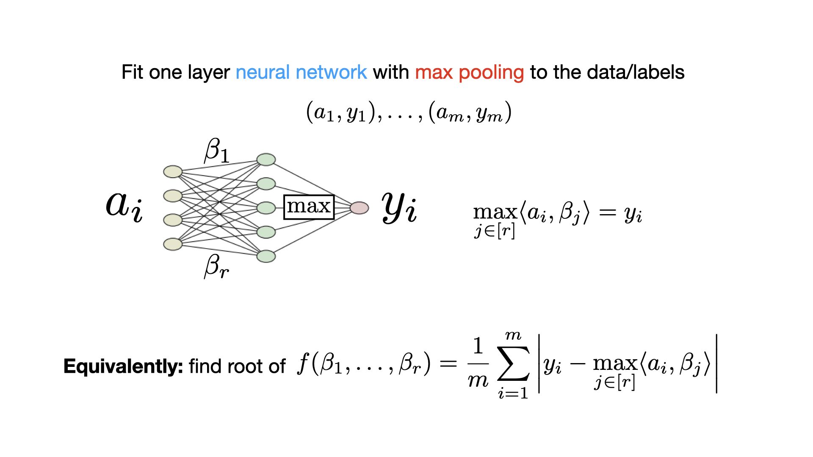
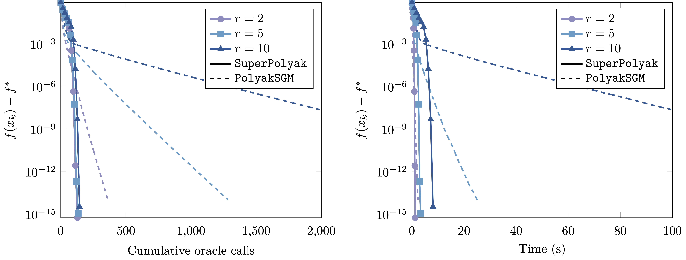

# Superpolyak.py

SuperPolyak.py is a pytorch library for solving nonsmooth equations. The library implements the SuperPolyak algorithm, the formal details of which can be found in the preprint:

V. Charisopoulos, D. Davis. A superlinearly convergent subgradient method for sharp semismooth problems, 2022. URL: https://arxiv.org/abs/2201.04611.

**Quick demo:** [SuperPolyakDemo.ipynb](SuperPolyakDemo.ipynb).

## What is SuperPolyak?

SuperPolyak is a **first-order** method for solving (possibly) nonsmooth equations of the form:

$$
f(\bar x) = 0
$$

where $f$ is a _nonnegative function_. As it is a first-order method, it is based solely on function and "gradient" evaluations.

When certain **minimal assumptions** are met, SuperPolyak locally converges **doubly exponentially fast** (i.e., "superlinearly").

### Example: Fitting a 1-hidden layer neural network with max-pooling

Let's try to fit a simple neural network with $d$ parameters, $r$ hidden units, and $m$ data samples. The next slide shows the network architecture:

Now let's plot the performance. 
- **Setup:** 
  - We use Gaussian data.
  - We set $d = 500$, we vary $r$ and we set $m = 3dr$.
  - We run SuperPolyak and a standard first-order method (Polyak). 
- **Conclusion:** 
  - Superpolyak outperforms Polyak both in terms of time and oracle calls (evals of $f$ and its gradient).

# How to use

## Two ways to run the code

SuperPolyak can be run in two ways. 

### Standalone optimizer class

How to use the optimizer class:

#### What a single step does (and what are the options)

Animation of algorithm from paper.

### Coupling with a fallback algorithm (e.g. SGD)

The figure from Vasilis presentation with fallback. 

An example code.