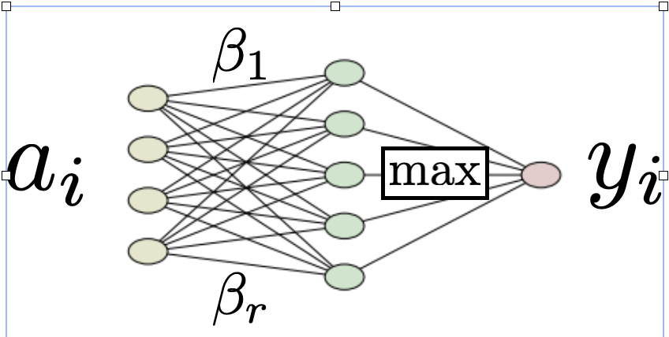

# Superpolyak.py

A pytorch implementation of the SuperPolyak subgradient method [0].

**Quick demo:** [SuperPolyakDemo.ipynb](SuperPolyakDemo.ipynb).

## What is SuperPolyak?

### Problem formulation 
 SuperPolyak [0] is a **first-order** method for solving (possibly) nonsmooth equations/optimization problems of the form:

$$
f(\bar x) = 0 \qquad \iff \qquad  \min f(x) 
$$

where $f$ is a _nonnegative function_ with minimal value $0$. When certain **minimal assumptions** are met, SuperPolyak locally converges **doubly exponentially fast** (i.e., "superlinearly").

#### Example 1: Fitting a 1-hidden layer neural network with max-pooling

Let's try to fit a simple neural network with max-pooling to data

$$
(a_1, y_1), \ldots, (a_m, y_m)
$$

The network has $d$ parameters, $r$ hidden units, and $m$ data samples. Concretely, we want to solve the $m$ equations for weights $\beta_j$:

$$
\max_{j \in [r]} \langle a_i, \beta_j\rangle = y_i \qquad i \in [m]  
$$

We reformulate this as a root finding problem: 

$$
\text{Find a root of } f(\beta_1, \ldots, \beta_r) = \frac{1}{m} \sum_{i=1}^m |y_i - \max_{j \in [r]} \langle a_i, \beta_j\rangle|.
$$

Now let's plot the **performance.** 
- **Setup:** 
  - We use Gaussian data.
  - We set $d = 500$, vary $r$, and set $m = 3dr$.
  - We run SuperPolyak and a standard first-order method (Polyak). 
- **Conclusion:** 
  - Superpolyak outperforms Polyak both in terms of time and oracle calls (evals of $f$ and its gradient).

### Example 2: Solving a smooth and strongly convex optimization  

**TODO:** Vas please make a pretty plot like the above for logistic regression.

# How to use

## Two ways to run the code

SuperPolyak can be run in two ways. 

### Standalone optimizer class

How to use the optimizer class:

#### What a single step does (and what are the options)

Animation of algorithm from paper.

### Coupling with a fallback algorithm (e.g. SGD)

The figure from Vasilis presentation with fallback. 

An example code.

# References

[0] V. Charisopoulos, D. Davis. A superlinearly convergent subgradient method for sharp semismooth problems, 2022. URL: https://arxiv.org/abs/2201.04611.